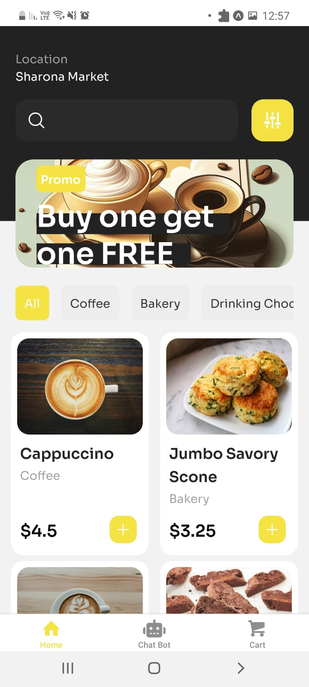
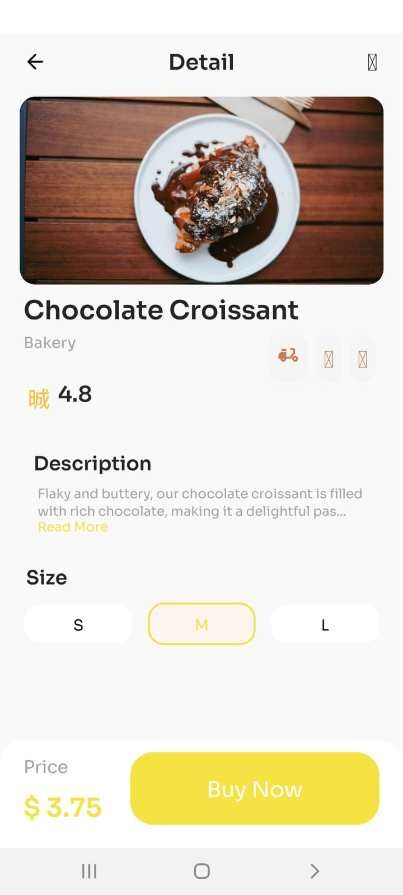
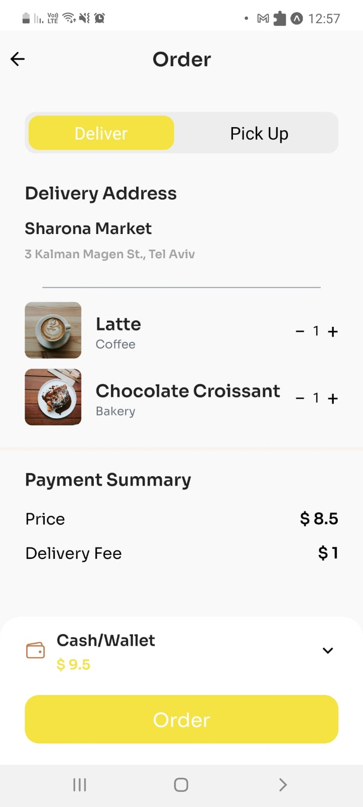
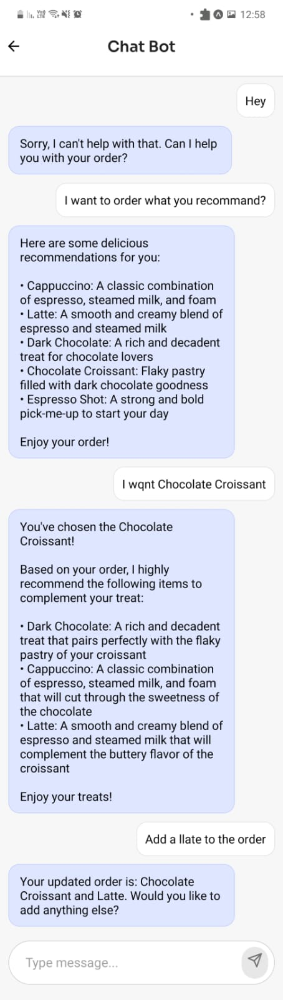

Coffee Shop Customer Service Chatbot 🚀☕

Welcome to the Coffee Shop Customer Service Chatbot project! This repository contains all the code, resources, and setup instructions needed to build an AI-powered chatbot designed to enhance customer experiences in a coffee shop app.

Using Large Language Models (LLMs), Natural Language Processing (NLP), and RunPod’s infrastructure, this chatbot can:

Take customer orders in real time.

Answer detailed menu questions (e.g., ingredients, allergens) using a Retrieval-Augmented Generation (RAG) system.

Provide personalized product recommendations using a market basket analysis engine.

Guide customers through a structured order process.

Block irrelevant or harmful queries with a Guard Agent for safe interactions.

🎯 Project Goals

This project aims to develop a smart chatbot that can:

Handle real-time customer interactions.

Offer accurate and structured order processing.

Provide personalized recommendations to enhance customer experience.

Answer menu-related questions with precise information.

Ensure safety by blocking inappropriate or irrelevant queries.

🧠 How It Works: Chatbot Agent System

The chatbot uses a modular agent-based system, where each agent has a specific task. This makes interactions smoother, more efficient, and scalable.

🧑‍💻 Key Agents:

Guard Agent: Screens user messages to block inappropriate or irrelevant queries.

Classification Agent: Determines the type of request (order, recommendation, menu inquiry, etc.) and forwards it to the right agent.

Order Taking Agent: Guides customers step-by-step through the ordering process.

Details Agent (RAG System): Answers menu-related questions using stored product data.

Recommendation Agent: Suggests complementary products to increase sales and enhance user experience.

⚙️ Agent Workflow:

The Guard Agent reviews incoming messages.

If valid, the Classification Agent identifies the intent.

The query is then sent to the appropriate agent:

Order Taking Agent processes orders and may consult the Recommendation Agent.

Details Agent fetches menu details.

Recommendation Agent suggests additional items.

📲 Coffee Shop Mobile App (React Native)

The chatbot is integrated into a React Native mobile app, providing a seamless user experience.

🌟 App Features:

Landing Page: Welcomes users.

Home Page: Displays featured menu items and categories.

Item Details Page: Provides descriptions, ingredients, and allergens.

Cart Page: Allows users to review and modify orders before checkout.

Chatbot Interface: Enables users to interact with the chatbot for orders, recommendations, and menu inquiries.

📚 Directory Structure

coffee_shop_customer_service_chatbot
├── coffee_shop_app_folder   # React Native app code  
├── python_code
│   ├── API/               # Chatbot API for agent-based system
│   ├── dataset/           # Dataset for recommendation engine
│   ├── products/          # Product data (names, prices, descriptions, images)
│   ├── build_vector_database.ipynb   # Builds vector database for RAG model
│   ├── firebase_uploader.ipynb       # Uploads products to Firebase
│   ├── recommendation_engine_training.ipynb  # Trains recommendation engine

🚀 Getting Started

Each folder contains setup instructions specific to its component, allowing you to deploy the frontend, backend, and database individually.

👉 Reference Links

RunPod – Infrastructure for deploying and scaling machine learning models.

Kaggle Dataset – Source for training the recommendation engine.

Figma – Design mockups for the app interface.

Hugging Face – Repository for Llama LLMs, used for chatbot NLP.

Pinecone – Vector database for efficient RAG processing.

Firebase – Cloud storage and database management for the app.

